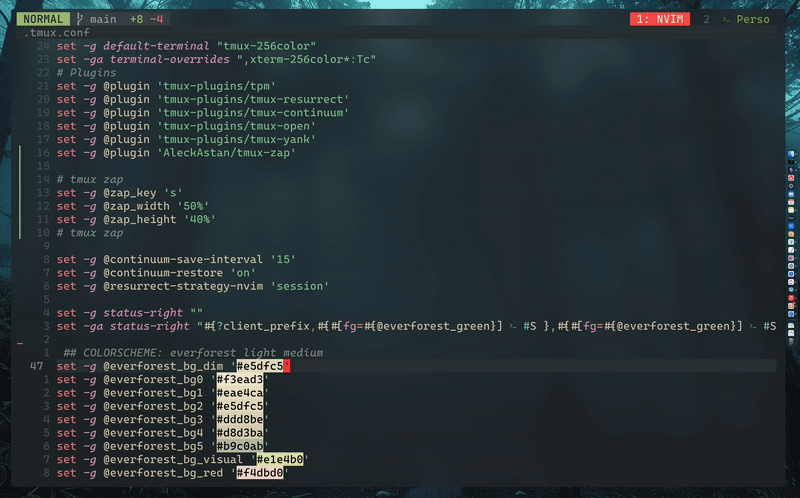

# tmux-zap

`tmux-zap` is a minimal tmux plugin that lets you **instantly jump to any window from any session** using fuzzy search.



## Features

- Lists **all windows** from all tmux sessions.
- Allows **fuzzy search** by window name.
- **Instant switching** to the selected window.
- **Customizable** keybinding and popup size.

## Installation

### With TPM (Tmux Plugin Manager)

Add the following to your `.tmux.conf`:

```tmux
set -g @plugin 'AleckAstan/tmux-zap'

# Optional configurations
set -g @zap_key 's'              # default: 'z'
set -g @zap_width '50%'          # default: '60%'
set -g @zap_height '40%'         # default: '60%'
```

Then reload your tmux config and install the plugin with:

```bash
# Press prefix + I (capital i) to install
```

### Manual Installation

```bash
git clone https://github.com/AleckAstan/tmux-zap ~/.tmux/plugins/tmux-zap
```

Add this to your `.tmux.conf`:

```tmux
run-shell ~/.tmux/plugins/tmux-zap/zap.tmux
```

## Usage

Press your configured keybinding (default is `prefix + z`, or `prefix + s` if set as above).

1. A popup window will appear listing all windows from all tmux sessions.
2. Type to fuzzy search for a window.
3. Press `Enter` to switch to the selected window.

## Configuration Options

| Option           | Default | Description                      |
|------------------|---------|----------------------------------|
| `@zap_key`       | `z`     | Keybinding to trigger the zap.   |
| `@zap_width`     | `60%`   | Width of the popup window.       |
| `@zap_height`    | `60%`   | Height of the popup window.      |

Example:

```tmux
set -g @zap_key 's'
set -g @zap_width '50%'
set -g @zap_height '40%'
```

## Requirements

- [fzf](https://github.com/junegunn/fzf)
- tmux >= 3.2 (popup support)

## License

MIT

